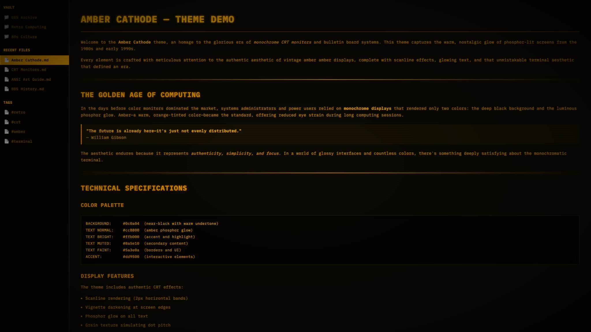

# Amber Cathode

An Obsidian dark theme inspired by 80s amber CRT monitors and BBS (Bulletin Board System) aesthetics.

## Features

- **Amber phosphor palette** — authentic monochrome CRT colour scheme
- **CRT scanlines** — horizontal line overlay simulating electron beam raster
- **Phosphor glow** — text-shadow on all elements for that warm glow
- **Screen vignette** — heavy edge darkening simulating barrel distortion
- **Phosphor grain** — subtle SVG noise simulating dot pitch structure
- **Full monospace** — IBM Plex Mono / JetBrains Mono throughout
- **Sharp corners** — zero border-radius for a true terminal feel
- **Subtle CRT flicker** — barely perceptible animation for immersion
- **BBS-themed demo** — includes a showcase file with ASCII art, BASIC code, and retro content

## Installation

1. Open Obsidian Settings → Appearance → Themes
2. Click "Manage" and search for **Amber Cathode**
3. Click "Install and use"

### Manual Installation

1. Download `theme.css` and `manifest.json`
2. Create a folder called `Amber Cathode` in your vault's `.obsidian/themes/` directory
3. Place both files inside
4. Activate the theme in Settings → Appearance

## Colour Palette

| Role | Hex |
|---|---|
| Phosphor Bright | `#ffb000` |
| Phosphor Normal | `#cc8800` |
| Phosphor Muted | `#8a5e10` |
| Phosphor Dim | `#5a3e0a` |
| Screen Black | `#0c0a04` |
| Sidebar | `#060400` |
| Border | `#2a2208` |

## Credits

Created by [Björn Kindler](https://www.kindler-webservices.de)

## License

MIT License — see [LICENSE](LICENSE)
